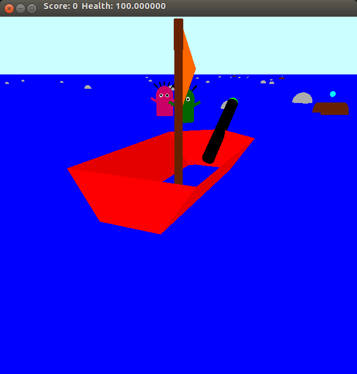
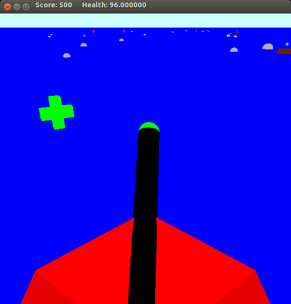
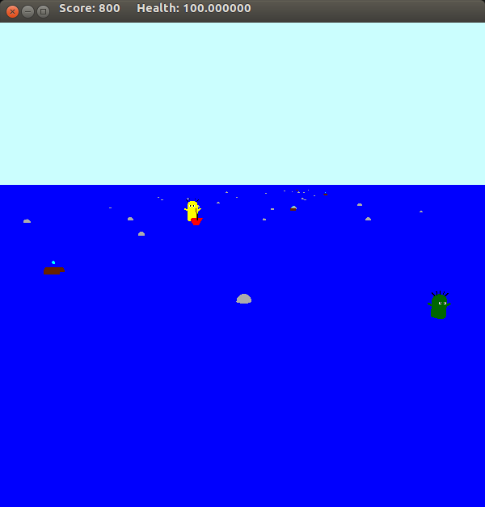

# Legend of Zelda
This is a 3D game inspired from Legend of Zelda.
You are Link and you
operate one of the finest boats in the Great Sea, which has several enemies trying to kill you. Your boat has a cannon which can be used to shoot enemies.

<br><br>

<br><br>

## Building and Execution
```
mkdir build
cd build/
cmake ..
make
./zelda
```

## Controls
- W - Move Forward
- A - Rotate Left
- S - Move Back
- D - Rotate Right
- Space - Jump
- F - Fire Cannon
- Mouse - Adjust cannon
- 1 - Follow Cam
- 2 - Boat View
- 3 - Top View
- 4 - Tower View
- 5 - Helicopter View
-- Mouse Drag - Move helicopter
-- Mousewheel - Zoom

## Features
- Your boat has a health of 100 points
- Hitting a rock will destroy it and decrease your health by 1.
- If the boat hits an enemy, your health will continuously decrease.
- The boss enemy appears after 3 kills.
- Killing an enemy will drop **health points** which can be taken to restore health.
- Jumping over **barrels** given you bonus points.
- There are 5 camera views present which can be toggled with the number keys.
  - Follow Cam view: This is a view of the ship and the region in front of it from a location behind
and above it, as if the camera is following the ship.
  - Boat view: This is a view from the ship’s position. In this view, we see what the ship sees, as if we were the ship.
  - Top View: This is a top-down view, as if we were looking vertically downwards from a position
in the sky. This gives a clear picture of the path.
  - Tower view: Here, the camera is sitting on a tower, on a coast far from the boat, observing it at an angle.
  - Helicopter-cam view: Here, the camera is in a helicopter in the sky. It is movable with the mouse. Clicking and dragging changes the look angle and the scroll wheel moves the camera closer or farther away from the scene.

## Rules
- Green Enemy- Hit: +200 points, Collide: -1 health per tick
- Purple Enemy- Hit: +100 points, Collide: -0.5 health per tick
- Yellow Enemy(Boss)- Hit: +1000 points, Collide: -100 health
- Jump over Barrel- +150 points
- Health Drops- +20
- Max Health- 100
